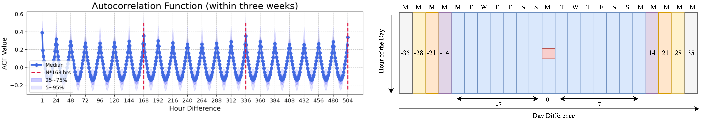

# Temporally Multi-Scale Sparse Self-Attention for Physical Activity Data Imputation


## Introduction

This repository contains code for our paper _Temporally Multi-Scale Sparse Self-Attention for Physical Activity Data Imputation_ (Wei et al.), which was accepted at Conference on Health, Inference, and Learning (CHIL) 2024.  

This project aims to address the issue of missing data in hourly step count data collected from smart watches and activity trackers (e.g., Apple Watch, Fitbit devices). To address this problem, we **proposed a sparse self-attention model** which captures the multi-timescale physical activity patterns and also designed a input feature representation to combine the time encoding (hour of day, day of week) with a temporally local activity pattern representation. Also, we **curated a large-scale cohort** from the Fitbit database of the _All of Us_ research program to serve as the train and test dataset. The results show that our model can outperform all the considered baselines on the overall test dataset.



Figure: The self-attention context window (Right) capturing the multi-timescale nature of the physical activity which is informed by the Autocorrelation Function (Left) from the step count data. 

**Paper**: [https://arxiv.org/abs/2406.18848](https://arxiv.org/abs/2406.18848)

**Contact**: [Hui Wei](mailto:huiwei@cs.umass.edu)

## Data

The data is publicly available upon registration in _All of Us_ [workbench](https://www.researchallofus.org/data-tools/workbench/). We used _All of Us_ Registered Tier Dataset v6 which consists of Fitbit records from 11,520 participants across the U.S.

##  Setup

Step 1: Create a cloud analysis enviroment (i.e. virtual machine) in _All of Us_ [workspace](https://workbench.researchallofus.org/login).

Step 2: Clone this github repo into the analysis environment. 

Step 3: Install all the required packages. 

```bash
python utils/package_utils.py
```

Step 4: Extract all the data from the Fitbit database.

```bash
python utils/data_utils.py
```

## Train

The train dataset consists of 100 participants with most observed data. Models can learn better physical activity pattern from more complete data. 

To create the train dataset:

```bash
python create_train_cohort.py
```

To create features for $k$-NN, CNN-DAE, and LAPR before training the models:

```
# kNN
cd baselines/knn
python create_knn_feat.py

# CNN-DAE
cd baselines/cnn_dae
python create_cnn_feat.py

# LAPR
python create_lapr_feat.py
```

 To train models, please first change directory to each model folder (except for the proposed model):

```bash
cd baseline/model_name
bash run_model.sh
```

## Test

The test dataset consists of 500 participants with various missing rates. The test participants are non-overlapping with the training participants to avoid the data leakage. 

To create the test dataset:

```
cd external_validation
python create_extvalid_cohort.py
python extvalid_utils.py
```

To create features for $k$-NN, CNN-DAE and also create LAPR features:

```
# kNN
cd external_validation/knn
python create_knn_feat.py

# CNN-DAE
cd external_validation/cnn_dae
python create_cnn_feat.py

# LAPR
cd external_validation/
python create_lapr_feat.py
```

To test models, please first chnge directory to each model folder:

```bash
cd external_validation/model_name
bash run_test.sh
```

## Reference
If you think our work is useful, please cite
```
@misc{wei2024temporallymultiscalesparseselfattention,
      title={Temporally Multi-Scale Sparse Self-Attention for Physical Activity Data Imputation}, 
      author={Hui Wei and Maxwell A. Xu and Colin Samplawski and James M. Rehg and Santosh Kumar and Benjamin M. Marlin},
      year={2024},
      eprint={2406.18848},
      archivePrefix={arXiv},
      primaryClass={cs.LG},
      url={https://arxiv.org/abs/2406.18848}, 
}
```
